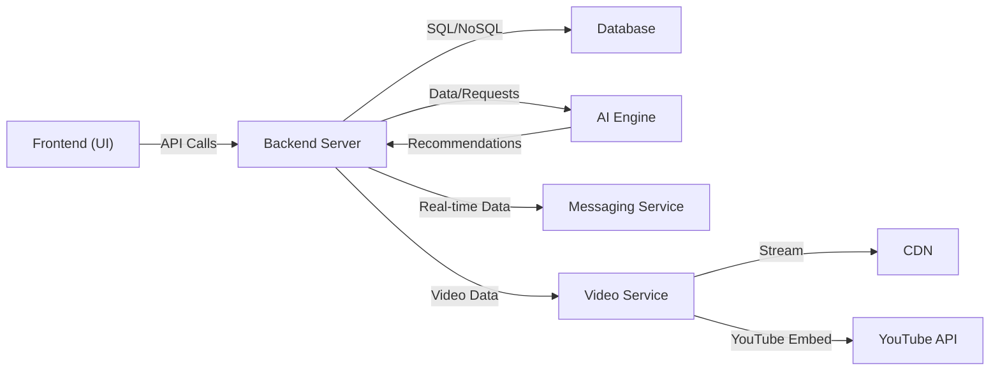

# Technical Documentation: System Architecture

## 3.1 Architecture Overview

The system will follow a microservices architecture, where each major feature (e.g., AI Engine, User Service, Communication Service) is an independent, scalable component. This approach provides flexibility, resilience, and allows for the use of different technologies for different services.

**Key Components:**

-   **Frontend (UI):** The user-facing application for students, teachers, and parents.
    
-   **API Gateway:** The single entry point for all frontend requests, directing traffic to the appropriate microservice.
    
-   **Auth Service:** Manages user authentication and authorization.
    
-   **Course & Content Service:** Handles all course-related data and content uploads.
    
-   **AI Engine Service:** The core of the platform, responsible for question generation, adaptive paths, and analytics.
    
-   **Real-time Communication Service:** Manages live chat, study groups, and proctoring sessions via WebSockets.
    
-   **Database Cluster:** The primary data store for the platform.
    
-   **Video Processing Service:** Handles video uploads, encoding, and streaming.
    
-   **Notification Service:** Manages email, push, and in-app notifications.
    

## Component Diagram (Expanded)

This diagram shows the relationship between key microservices and external tools, highlighting the modular nature of the architecture.

