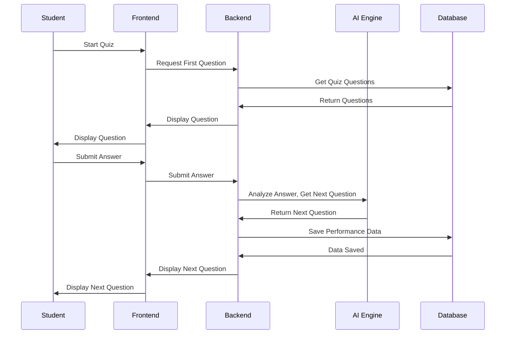
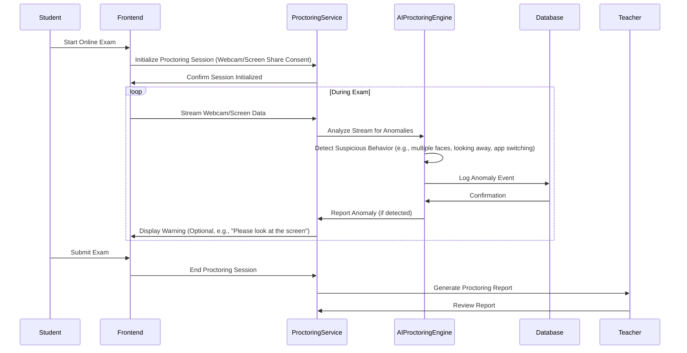

# UI/UX Documentation: User Flows

User flows illustrate the path a user takes to complete a specific task within the system. They are crucial for understanding the user journey, identifying potential pain points, and ensuring a smooth and intuitive user experience.

## 1. User Flow: Adaptive Question Generation (Student Perspective)

This diagram shows the sequence of interactions when a student takes a quiz and the AI generates the next question.

**Explanation of Flow:**

1.  **Student Initiates Quiz:** The student decides to start a quiz from their dashboard or a course page.
2.  **Frontend Requests Question:** The UI sends a request to the backend for the first question.
3.  **Backend Retrieves Questions:** The backend fetches relevant quiz questions from the database.
4.  **Question Display:** The question is sent back to the frontend and displayed to the student.
5.  **Student Submits Answer:** The student provides an answer and submits it through the UI.
6.  **Backend Processes Answer:** The backend receives the answer and forwards it to the AI Engine for analysis.
7.  **AI Generates Next Question:** The AI Engine analyzes the student's answer, assesses their understanding, and determines the next appropriate question (or indicates quiz completion).
8.  **Performance Data Saved:** The student's performance data is saved to the database.
9.  **Next Question Displayed:** The next question (or quiz results) is sent back to the frontend and displayed to the student.

## 2. User Flow: Smart Proctoring (During Exam)

This diagram details the step-by-step process of a student taking an exam with the AI proctoring service.

**Explanation of Flow:**

1.  **Student Starts Exam:** The student begins an online exam.
2.  **Proctoring Initialization:** The frontend requests the Proctoring Service to initialize a session, requiring student consent for webcam and screen sharing.
3.  **Data Streaming:** Throughout the exam, the frontend continuously streams webcam and screen data to the Proctoring Service.
4.  **AI Analysis:** The Proctoring Service forwards this data to the AI Proctoring Engine, which analyzes the streams in real-time for suspicious behaviors.
5.  **Anomaly Detection & Logging:** If anomalies are detected (e.g., multiple faces, looking away, unauthorized application switching), the AI logs these events in the database.
6.  **Optional Warning:** The Proctoring Service can optionally send a warning back to the frontend to alert the student.
7.  **Exam Submission:** The student completes and submits the exam.
8.  **Session End & Report Generation:** The proctoring session ends, and the Proctoring Service generates a detailed report for the teacher, summarizing any detected anomalies.
9.  **Teacher Review:** The teacher reviews the proctoring report to assess academic integrity.
