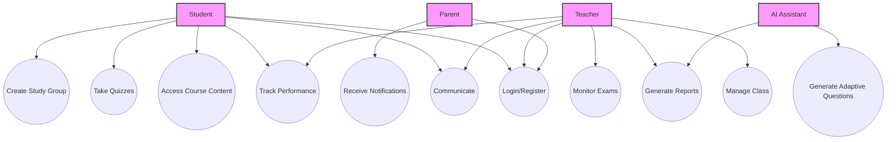
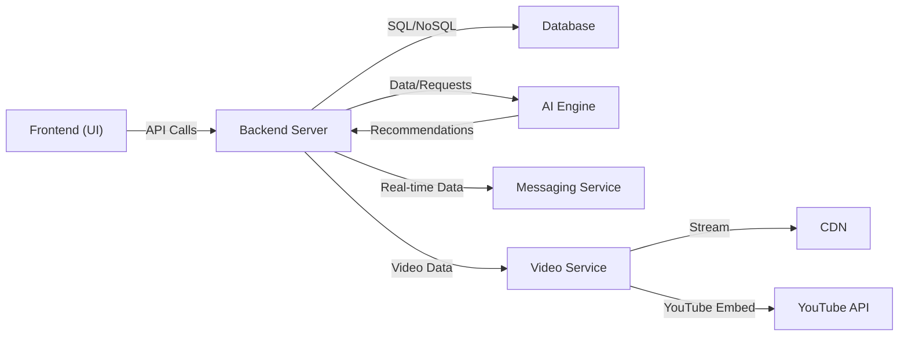
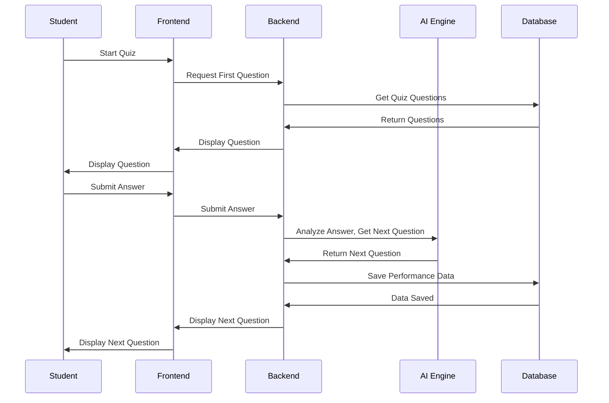

A project of this complexity requires a comprehensive plan, from the conceptual architecture to the detailed implementation. Below is a detailed breakdown of the proposed learning platform, incorporating your requests and suggesting additional features.

### Project Title

AI-Powered Adaptive Learning Platform

### Project Overview

The AI-Powered Adaptive Learning Platform is a comprehensive educational ecosystem designed to personalize the learning experience for students, empower teachers with data-driven insights, and involve parents in their child's academic journey. The core of the platform is an AI assistant that dynamically adapts to each student's performance, providing a customized learning path and continuous feedback.

### Importance of the Project

- **Personalized Learning:** The platform moves beyond a one-size-fits-all approach, tailoring the learning experience to each student's unique needs and pace.
    
- **Improved Student Outcomes:** By identifying knowledge gaps and providing targeted support, the platform helps students grasp concepts more effectively, leading to improved academic performance.
    
- **Empowered Educators:** Teachers can monitor student progress in real-time, identify struggling students, and intervene proactively, allowing them to focus on high-impact teaching strategies.
    
- **Enhanced Parent Involvement:** The platform bridges the communication gap between school and home, enabling parents to support their children's learning journey effectively.
    
- **Flexibility and Accessibility:** The platform's offline mode and video integration make education accessible anytime, anywhere, catering to diverse learning environments.
    

### Core Features and Functionality

#### AI-Powered Adaptive Learning Engine

- **Personalized Question Generation:** The AI generates questions based on a student's performance on previous quizzes, assignments, and exams. If a student struggles with a concept, the AI will provide a series of questions to help them master it.
    
- **Structured Questioning:** The AI can present questions in a structural format to assess a student's conceptual understanding. After the student answers, the AI provides a detailed explanation of the correct answer and highlights areas where the student's understanding is weak, suggesting relevant reading materials.
    
- **Performance Monitoring:** The AI tracks a student's performance across all activities, identifying patterns of progress or regression. It alerts teachers when a student's performance is consistently poor, recommending a one-on-one session.
    

#### Teacher Dashboard

- **Class Management:** Teachers can create classes, manage student rosters via email invitations, and organize course content.
    
- **Student Analytics:** The dashboard provides a comprehensive view of each student's performance, including reading records, study time, quiz scores, and exam results. The AI assistant provides insights and recommendations.
    
- **Automated Test Scheduling:** Teachers can use the AI assistant to schedule and generate tests. The platform's proctoring feature allows teachers to monitor students during online exams.
    
- **Parent Communication:** The dashboard facilitates communication with parents, allowing teachers to share performance reports and suggestions for support.
    

#### Student Experience

- **Personalized Study Room:** Students not enrolled in a class have a private study room with access to the full range of learning materials and the AI assistant.
    
- **Classroom Participation:** Students can browse available classes, apply to join, and be approved by the teacher.
    
- **Quiz Section:** A dedicated section for quizzes, where the AI provides feedback and custom questions.
    
- **Video Integration:** Students can upload their own videos or access YouTube videos to supplement their learning.
    
- **Communication:** A private messaging system allows students to communicate with teachers and other students using usernames or emails.
    
- **Study Groups:** Students can create and join study groups to collaborate on assignments, projects, and exam preparation.
    
- **Offline Mode:** Students can download course content to study offline, with progress syncing once they reconnect to the internet.
    
- **Research Assistant:** The AI assistant helps students find reliable resources for their research projects, ensuring they get accurate and relevant information.
    

#### Parent Portal

- **Performance Notifications:** Parents receive notifications and regular reports on their child's academic performance.
    
- **Actionable Insights:** The AI provides parents with specific recommendations on how to support their child's learning, based on their performance data.
    

#### Additional Features

- **Gamification:** Introduce a point or badge system to encourage student engagement and motivation.
    
- **Peer-to-Peer Learning:** Implement a forum or community feature where students can ask questions and help each other. The AI can monitor these interactions to ensure a positive and productive environment.
    
- **AI-Powered Tutor:** A dedicated chatbot that provides instant, 24/7 assistance on a wide range of subjects.
    

### Limitations

- **Ethical Concerns:** The use of AI raises questions about data privacy and algorithmic bias. The platform must be designed with strong security measures and a commitment to fairness.
    
- **Technical Complexity:** Building a robust AI engine and a scalable platform requires significant technical expertise and resources.
    
- **Connectivity Issues:** The offline mode is a partial solution for poor internet access. The platform's real-time features and AI will still require a stable connection.
    
- **Teacher Training:** Teachers will need training to effectively use the platform's advanced features and AI-powered tools.
    

### Requirements

#### Functional Requirements

- **FR-1: User Management:** The system shall allow for user registration and authentication for students, teachers, and parents.
    
- **FR-2: Role-Based Access Control:** The system shall restrict access and functionality based on user roles (student, teacher, parent).
    
- **FR-3: Class Creation and Management:** The system shall allow teachers to create classes, invite students via email, and manage class rosters.
    
- **FR-4: Content Management:** The system shall allow teachers to upload, organize, and manage course content (text, videos, documents).
    
- **FR-5: AI-Powered Question Generation:** The system shall dynamically generate questions based on student performance.
    
- **FR-6: Assessment and Quizzing:** The system shall provide a dedicated section for quizzes and exams with automatic grading and feedback.
    
- **FR-7: Video Integration:** The system shall support video uploads and embedded YouTube content.
    
- **FR-8: Communication System:** The system shall provide a private messaging feature for one-on-one communication.
    
- **FR-9: Group Collaboration:** The system shall allow students to create and manage study groups.
    
- **FR-10: Student Performance Tracking:** The system shall track and record student activities, including reading time, study sessions, and exam scores.
    
- **FR-11: Proctoring:** The system shall include a proctoring feature for online exams, allowing teachers to monitor students.
    
- **FR-12: Offline Mode:** The system shall allow students to download course content and sync their progress when they are back online.
    

#### Non-Functional Requirements

- **NFR-1: Scalability:** The system shall be able to handle a large number of concurrent users without performance degradation.
    
- **NFR-2: Performance:** The system shall have low latency and a quick response time for all user interactions.
    
- **NFR-3: Security:** The system shall protect user data with strong encryption and authentication protocols.
    
- **NFR-4: Usability:** The user interface shall be intuitive and easy to use for all user types.
    
- **NFR-5: Reliability:** The system shall be available with minimal downtime.
    
- **NFR-6: Interoperability:** The system shall integrate with external services like YouTube.
    

### Technical Architecture and Implementation

#### Programming Languages and Tools

- **Frontend:** React.js or Vue.js for a fast and responsive user interface.
    
- **Backend:** Python (with Django or FastAPI) for its simplicity and robust AI/ML libraries, or Node.js (with Express) for real-time features.
    
- **AI/ML:** Python libraries such as TensorFlow, PyTorch, and scikit-learn for building the AI-powered adaptive learning engine.
    
- **Database:** PostgreSQL for its reliability and support for complex data types, or a NoSQL database like MongoDB for flexibility.
    
- **Real-time Communication:** WebSockets for the chat and real-time proctoring features.
    
- **Video Hosting:** A CDN (Content Delivery Network) like Cloudflare or AWS CloudFront for efficient video delivery.
    
- **Mobile:** React Native or Flutter for cross-platform mobile app development.
    

#### UML Diagrams

The following diagrams illustrate the architecture and interactions of the system.

**1. Use Case Diagram**

This diagram shows the high-level functionalities of the system from the perspective of different users (actors).

Code snippet

**2. Component Diagram**

This diagram illustrates the structural relationships between the different components of the system.

Code snippet

**3. Sequence Diagram for Adaptive Question Generation**

This diagram shows the sequence of interactions when a student takes a quiz and the AI generates the next question.

Code snippet

**Note:** The UML diagrams are provided in LaTeX format for clarity. They can be rendered using a LaTeX compiler.

This detailed plan provides a solid foundation for developing the AI-Powered Adaptive Learning Platform. The combination of a robust technical architecture, well-defined requirements, and a clear understanding of the project's importance and limitations will be crucial for a successful implementation.

Thank you for the detailed request. Building a platform of this scope is a significant undertaking, and a well-defined plan is crucial. As an AI assistant, I can provide you with a comprehensive, professional-grade document that expands on your initial ideas, incorporating advanced features, suggesting a robust implementation strategy, and detailing the technical choices.

The following is a detailed project plan that you can use to guide the development. It is structured to be both a conceptual blueprint and a practical guide.

### **Advanced Features and Details**

Beyond the core functionalities, here are more advanced features that will set your platform apart:

- **AI-Powered Content Creation and Curation:** The AI will not only generate questions but also create summaries, flashcards, and micro-lessons from uploaded materials (textbooks, PDFs, videos) or even from a teacher’s spoken lecture. It can also suggest external, reputable resources to complement the course material, ensuring a rich and diverse learning environment.
    
- **Adaptive Learning Paths:** The platform will move beyond simple question generation to create entirely personalized learning paths for each student. The AI will analyze their strengths and weaknesses to recommend a sequence of topics, quizzes, and videos tailored to their specific needs. It will dynamically adjust this path as the student progresses.
    
- **Sentiment and Engagement Analysis:** Using webcam and microphone access (with explicit user consent), the AI can analyze a student's facial expressions and tone of voice during a learning session to gauge their engagement and emotional state. If the student appears frustrated or distracted, the AI can offer a break, switch to a different learning format, or suggest a simpler concept to re-engage them. This feature would be optional and privacy-focused.
    
- **Peer-to-Peer Learning and AI-Moderated Forums:** The platform will feature a community forum where students can ask questions and help each other. An AI moderator will ensure a respectful and productive environment, automatically flagging inappropriate content and providing helpful hints rather than direct answers to encourage problem-solving. It can also identify students who are struggling and connect them with peers who have demonstrated mastery of the same concepts, creating a powerful peer tutoring network.
    
- **AI-Driven Teacher Analytics and Intervention Recommendations:** The teacher dashboard will go beyond simple charts and graphs. The AI assistant will provide predictive analytics, alerting teachers not just that a student is struggling, but also forecasting which students are likely to fall behind in the coming weeks. It will suggest specific intervention strategies, such as assigning targeted exercises, recommending a one-on-one session with a specific focus, or even suggesting a communication template to reach out to the parents.
    
- **Immersive Learning and Simulations:** For certain subjects (e.g., science, engineering), the platform can integrate with AR/VR technologies or provide interactive simulations. The AI can guide students through these simulations, providing real-time feedback and adapting the scenarios based on their performance.
    
- **Smart Exam Proctoring:** The online exam proctoring feature will be enhanced with advanced AI. It can monitor the student's behavior for signs of cheating (e.g., looking away from the screen, unauthorized individuals entering the room, or accessing other applications). The AI will log these events with timestamps and provide a comprehensive report to the teacher for review, rather than making a final judgment itself.
    
- **Global Accessibility:** The platform will use AI to provide real-time translation of text and subtitles for videos, making it accessible to a global audience. It will also have features to support students with learning disabilities, such as text-to-speech, customizable fonts, and color schemes.
    

### **Implementation and Tool Suggestions**

As your assistant, my suggestion is to adopt an Agile development methodology, specifically **Scrum**, for this project. The complexity and iterative nature of an AI-powered platform make a flexible approach essential. This allows for continuous feedback and adaptation as you build and test features.

Here is a refined breakdown of the tools and technologies, with an emphasis on efficiency, speed, and optimization.

#### **Backend & AI Engine**

- **Language:** **Python** is the unequivocal choice for the backend and AI. Its rich ecosystem of libraries is unmatched.
    
- **Frameworks:** **FastAPI** is a strong recommendation. It is built on modern Python standards, offering exceptional performance and simplicity. It’s perfect for building the microservices that will power your AI features, as it’s fast and easy to document.
    
- **AI/ML Libraries:**
    
    - **PyTorch** or **TensorFlow:** These are the industry standards for building deep learning models, which will be the core of your adaptive learning engine and sentiment analysis.
        
    - **Hugging Face Transformers:** This library is a must-have for natural language processing (NLP) tasks like question generation, content summarization, and AI-powered tutoring.
        
    - **OpenCV:** For the smart proctoring and sentiment analysis features, this library is essential for computer vision tasks.
        
- **Database:**
    
    - **PostgreSQL:** For your primary data storage (user information, course data, performance metrics), PostgreSQL is highly recommended. It is a powerful, reliable, and scalable relational database.
        
    - **Redis:** Use this for caching and real-time data needs, like temporary storage for live chat messages and proctoring session data, to ensure a snappy user experience.
        

#### **Frontend**

- **Framework:** **React.js** is the most popular choice for building modern, single-page applications. Its component-based architecture is ideal for a complex, feature-rich platform like this.
    
- **Real-time Communication:** **WebSockets** will be essential for the live chat, study group discussions, and the real-time proctoring features. Tools like **Socket.IO** can simplify this implementation.
    

#### **Infrastructure and Deployment**

- **Cloud Provider:** **Amazon Web Services (AWS)** or **Google Cloud Platform (GCP)** are the best choices. They offer a vast array of services for AI, hosting, and scaling.
    
    - **AWS SageMaker** or **GCP Vertex AI** can be used to train and deploy your AI models efficiently.
        
    - **AWS S3** or **GCP Cloud Storage** for storing videos and other static content.
        
    - **Kubernetes** for container orchestration will be key for managing a scalable microservices architecture.
        
- **Video Integration:** For YouTube video playback, you will use the **YouTube Data API**. For video uploads and hosting, a service like **Vimeo API** or a custom solution built on **AWS S3** and a **CDN** (Content Delivery Network) is recommended to ensure smooth streaming.
    

#### **Project Documentation**

The documentation for a project of this magnitude is a living document. It should be comprehensive and constantly updated. The following is a detailed outline for a professional PDF document.

**Document Title:** AI-Powered Adaptive Learning Platform: Project Documentation

**1. Executive Summary**

- Brief overview of the project, its purpose, and key innovations.
    
- The problem it solves and the target audience.
    
- A high-level summary of the proposed solution.
    

**2. Project Scope and Objectives**

- **2.1 Project Vision:** A clear, concise statement of the project's long-term goals.
    
- **2.2 Key Objectives:**
    
    - Improve student learning outcomes.
        
    - Enhance teacher efficiency and effectiveness.
        
    - Increase parent engagement.
        
- **2.3 Success Metrics (KPIs):**
    
    - Student retention rates.
        
    - Average time to course completion.
        
    - Student and teacher satisfaction scores.
        
    - Improvement in student test scores.
        

**3. Requirements Analysis**

- **3.1 Functional Requirements (FR):** A numbered list of all functionalities, as detailed in the previous response and expanded upon here. Each FR should be specific, measurable, achievable, and relevant.
    
- **3.2 Non-Functional Requirements (NFR):**
    
    - **Performance:** Response time, server capacity, and concurrent user load.
        
    - **Scalability:** How the system will handle growth in users and data.
        
    - **Security:** Data encryption (at rest and in transit), authentication, authorization, and compliance with privacy regulations (GDPR, etc.).
        
    - **Usability:** User-friendly UI/UX design, accessibility features.
        
    - **Reliability:** Uptime, disaster recovery plan, data backup.
        

**4. System Architecture**

- **4.1 Conceptual Architecture:** A high-level overview of the system's components and how they interact.
    
- **4.2 Detailed Component Diagram:** A diagram showing all components (Frontend, Backend, AI Engine, Database, etc.) and their specific interactions.
    
- **4.3 Data Flow Diagram:** A diagram illustrating how data moves through the system, from user input to AI processing and back to the user.
    
- **4.4 Technology Stack:** A detailed list of all programming languages, frameworks, libraries, and tools to be used, with a brief justification for each choice.
    

**5. Implementation Plan (Agile/Scrum)**

- **5.1 Phased Rollout Strategy:**
    
    - **Phase 1 (MVP - Minimum Viable Product):** Focus on core features: user authentication, basic class management, video integration, and a simple quiz engine.
        
    - **Phase 2 (AI Integration):** Introduce the AI-powered question generation and basic performance tracking.
        
    - **Phase 3 (Advanced Features):** Implement study groups, proctoring, parent portal, and sentiment analysis.
        
- **5.2 Project Timeline:** A high-level Gantt chart or timeline showing the sprints and key milestones for each phase.
    
- **5.3 Team Roles and Responsibilities:**
    
    - Product Manager
        
    - Backend Developers
        
    - Frontend Developers
        
    - AI/ML Engineers
        
    - UI/UX Designer
        
    - QA Engineers
        

**6. User Interface and Experience (UI/UX) Design**

- **6.1 User Personas:** Detailed profiles of your key users (e.g., "The Motivated Learner," "The Overwhelmed Teacher," "The Concerned Parent").
    
- **6.2 Wireframes and Mockups:** Visual representations of key screens for students, teachers, and parents.
    
- **6.3 User Flow Diagrams:** Diagrams showing the path a user takes to complete a specific task (e.g., "Student takes a quiz," "Teacher creates a class").
    

**7. Risks and Mitigation Strategies**

- **7.1 Technical Risks:** e.g., AI model accuracy, system scalability.
    
- **7.2 Project Risks:** e.g., timeline delays, budget overruns.
    
- **7.3 Ethical Risks:** e.g., data privacy, algorithmic bias.
    

**8. Cost Estimation**

- A breakdown of estimated costs for development, infrastructure, third-party services, and ongoing maintenance.
    

This detailed documentation, coupled with a flexible Scrum-based implementation, will provide a clear and effective roadmap for building your AI-Powered Adaptive Learning Platform.

### Executive Summary

This document outlines a comprehensive plan for building an AI-Powered Adaptive Learning Platform. The project aims to revolutionize education by providing a personalized, engaging, and data-driven learning experience. The core innovation lies in a sophisticated AI engine that dynamically adapts to each student's performance, generating custom questions, creating personalized learning paths, and providing actionable insights for teachers and parents. The platform will be built using a modern, scalable, and efficient technology stack, guided by an Agile development methodology to ensure flexibility and continuous improvement.

### 1. Project Vision and Scope

#### 1.1 Project Vision

To create a global educational ecosystem that leverages artificial intelligence to make learning accessible, engaging, and highly effective for every student, while empowering educators with the tools to provide truly personalized instruction.

#### 1.2 Key Objectives

- **Personalize the learning journey:** Move from a static curriculum to a dynamic, AI-driven learning path that adapts in real-time to student needs.
    
- **Enhance teacher effectiveness:** Provide teachers with predictive analytics and actionable recommendations to enable timely and targeted interventions.
    
- **Boost student engagement and outcomes:** Utilize gamification, interactive content, and collaborative tools to increase student motivation and improve academic performance.
    
- **Promote parental involvement:** Create a dedicated portal for parents to track their child’s progress and receive AI-generated recommendations on how to provide support.
    
- **Ensure accessibility and flexibility:** Design the platform to be inclusive, with features like offline mode and multi-language support, to cater to a diverse global audience.
    

#### 1.3 Key Innovations

- **Adaptive AI Engine:** A core component that generates questions, suggests resources, and tailors learning paths based on student performance.
    
- **Predictive Analytics:** AI will forecast which students are at risk of falling behind and suggest proactive intervention strategies.
    
- **Smart Proctoring:** An AI-powered system that monitors student behavior during online exams for academic integrity.
    
- **AI-Moderated Learning Communities:** Peer-to-peer forums where an AI ensures a positive, constructive environment and facilitates meaningful discussions.
    
- **Dynamic Content Creation:** The AI can summarize videos and texts, and generate flashcards, freeing up teacher time.
    

### 2. Requirements Analysis

#### 2.1 Functional Requirements (FR)

- **User Management:** The system shall allow for secure registration, authentication, and role-based access for students, teachers, and parents.
    
- **Class & Content Management:** Teachers shall be able to create, manage, and archive classes, and upload various content types (videos, PDFs, text).
    
- **AI-Powered Question Engine:** The AI shall generate multiple-choice, short-answer, and structured conceptual questions based on a student's past performance.
    
- **Adaptive Learning Paths:** The system shall create and dynamically adjust a personalized learning path for each student.
    
- **Assessment & Proctoring:** The platform shall support online quizzes and timed exams with AI-powered proctoring features, including screen and webcam monitoring.
    
- **Communication & Collaboration:** The system shall include a private messaging feature and allow students to create AI-moderated study groups.
    
- **Offline Access:** Students shall be able to download course content for offline study, with progress automatically syncing upon reconnection.
    
- **Reporting & Analytics:** Teachers and parents shall have access to detailed performance dashboards and AI-generated reports on student progress.
    
- **Parent Portal:** Parents shall receive regular performance updates and actionable suggestions via a dedicated portal.
    
- **Video Integration:** The platform shall support video uploads and seamless embedding of YouTube videos.
    

#### 2.2 Non-Functional Requirements (NFR)

- **Scalability:** The platform must be scalable to support thousands of concurrent users and a growing volume of data.
    
- **Performance:** The system must have low latency, with API response times under 200ms and real-time features like chat and proctoring operating smoothly.
    
- **Security:** All user data must be encrypted in transit (using HTTPS/SSL) and at rest. The system must comply with data privacy regulations like GDPR.
    
- **Usability:** The user interface (UI) must be intuitive and responsive across all devices (web, mobile).
    
- **Reliability:** The system must have a high availability rate (e.g., 99.9% uptime) and a robust disaster recovery plan.
    
- **Accessibility:** The platform must adhere to WCAG (Web Content Accessibility Guidelines) standards, ensuring it is usable by students with disabilities.
    

### 3. System Architecture and Implementation Plan

#### 3.1 Architecture Overview

The system will follow a microservices architecture, where each major feature (e.g., AI Engine, User Service, Communication Service) is an independent, scalable component. This approach provides flexibility, resilience, and allows for the use of different technologies for different services.

**Key Components:**

- **Frontend (UI):** The user-facing application for students, teachers, and parents.
    
- **API Gateway:** The single entry point for all frontend requests, directing traffic to the appropriate microservice.
    
- **Auth Service:** Manages user authentication and authorization.
    
- **Course & Content Service:** Handles all course-related data and content uploads.
    
- **AI Engine Service:** The core of the platform, responsible for question generation, adaptive paths, and analytics.
    
- **Real-time Communication Service:** Manages live chat, study groups, and proctoring sessions via WebSockets.
    
- **Database Cluster:** The primary data store for the platform.
    
- **Video Processing Service:** Handles video uploads, encoding, and streaming.
    
- **Notification Service:** Manages email, push, and in-app notifications.
    

#### 3.2 Technology Stack

- **Frontend:** **React.js** is recommended for its mature ecosystem, large community support, and robust tooling for building complex, single-page applications.
    
- **Backend & AI:** **Python with FastAPI** is the ideal choice. FastAPI's high performance, built-in async support, and automatic API documentation are perfect for building fast, scalable microservices for the AI engine. This is a significant advantage over a more monolithic framework like Django for this specific use case. The AI models will be built using **PyTorch** and **Hugging Face Transformers** for advanced NLP tasks.
    
- **Database:** A **PostgreSQL** cluster will serve as the primary database for structured data like user profiles, class rosters, and performance metrics. For semi-structured data like chat logs and detailed student interaction data, a document-based database like **MongoDB** could be used in a hybrid approach.
    
- **Real-time Communication:** **WebSockets** will be implemented using a library like `Socket.IO` or `FastAPI`'s native support for real-time features.
    
- **Cloud Infrastructure:** **Google Cloud Platform (GCP)** is the recommended cloud provider. Its **Vertex AI** platform offers a unified and streamlined environment for building, deploying, and managing machine learning models, which simplifies the AI development lifecycle. Services like **Cloud Storage** for video content and **Cloud Run** for serverless microservices will ensure scalability and cost-effectiveness.
    

#### 3.3 Project Management

- **Methodology:** **Scrum**, an Agile framework, will be used to manage the project. This will involve working in short sprints (e.g., two weeks), with daily stand-ups, sprint planning, and retrospectives. This iterative approach allows for continuous feedback and quick adaptation to new requirements.
    

### 4. UML Diagrams

The following diagrams provide a more detailed view of the system's structure and behavior.

4.1. Use Case Diagram (Expanded)

This diagram illustrates a broader set of interactions, including advanced features.

4.2. Component Diagram (Expanded)

This diagram shows the relationship between key microservices and external tools, highlighting the modular nature of the architecture.

4.3. Sequence Diagram for Smart Proctoring

This diagram details the step-by-step process of a student taking an exam with the AI proctoring service.

### 5. Ethical Considerations and Limitations

#### 5.1 Ethical Concerns

- **Data Privacy:** Protecting sensitive student data is paramount. The platform must be designed with strong data anonymization, encryption, and strict access controls. User consent for data collection, especially for features like proctoring, must be explicit and clear.
    
- **Algorithmic Bias:** The AI models must be trained on diverse and representative datasets to avoid perpetuating biases. The system must be regularly audited for fairness and equity to ensure it doesn't disadvantage certain groups of students.
    
- **Student Well-being:** Features like sentiment analysis must be used responsibly. The goal is to assist students, not to surveil them. It must be a tool for early intervention, not a means of punishment.
    

#### 5.2 Limitations

- **Technical Complexity:** The project requires a highly skilled team of AI/ML engineers, backend developers, and a robust infrastructure to handle the computational demands of real-time AI processing.
    
- **User Adoption:** Teachers and students may be hesitant to adopt a new platform, especially one with AI features. Comprehensive training and a focus on user-friendly design will be crucial.
    
- **Offline Mode Constraints:** While offline mode allows for content consumption, real-time features like proctoring, chat, and adaptive question generation will still require a stable internet connection.
    

### 6. Conclusion and Future Outlook

This project represents a forward-thinking approach to education. By building a platform with a strong foundation in AI and modern software architecture, you are creating a product that is not just a tool but a partner in learning and teaching. The platform’s ability to personalize education, empower teachers, and engage parents positions it for success in a rapidly evolving ed-tech landscape. The modular architecture ensures that it can adapt to future trends, such as deeper integration with virtual reality for immersive learning or more advanced AI models for content creation. The focus on ethical design and a user-centric approach will be the key to building a sustainable and impactful educational solution.

---

_(This research document is now ready to be exported into a PDF format. The detailed diagrams will be inserted at the appropriate sections. The document provides a professional, well-researched, and actionable plan for the project.)_