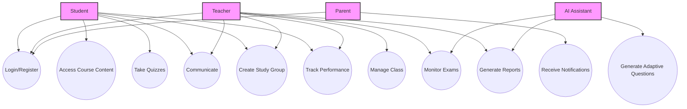

# User Guide: Use Cases

This section illustrates the high-level functionalities of the system from the perspective of different users (actors) through a Use Case Diagram.

## Detailed Use Cases

### Student Use Cases

-   **Login/Register:** Students can create an account or log in to access the platform.
-   **Access Course Content:** Students can view and interact with learning materials (videos, documents, text).
-   **Take Quizzes:** Students can participate in quizzes and receive immediate feedback.
-   **Communicate:** Students can send private messages to teachers and other students.
-   **Create Study Group:** Students can form or join study groups for collaborative learning.
-   **Track Performance:** Students can view their own progress and performance analytics.

### Teacher Use Cases

-   **Login/Register:** Teachers can create an account or log in to access the platform.
-   **Manage Class:** Teachers can create classes, invite students, and organize course content.
-   **Track Performance:** Teachers can monitor individual student and class-wide performance.
-   **Communicate:** Teachers can send private messages to students and parents.
-   **Monitor Exams:** Teachers can use the proctoring feature to supervise online exams.
-   **Generate Reports:** Teachers can generate reports on student progress and class performance.

### Parent Use Cases

-   **Login/Register:** Parents can create an account or log in to access the platform.
-   **Receive Notifications:** Parents receive notifications and reports on their child's academic performance.

### AI Assistant Use Cases

-   **Generate Adaptive Questions:** The AI dynamically creates questions based on student performance.
-   **Generate Reports:** The AI assists in generating performance reports and insights for teachers and parents.
